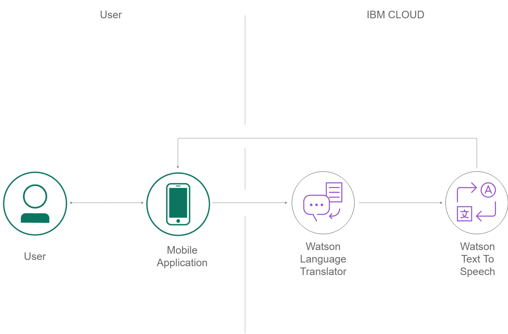
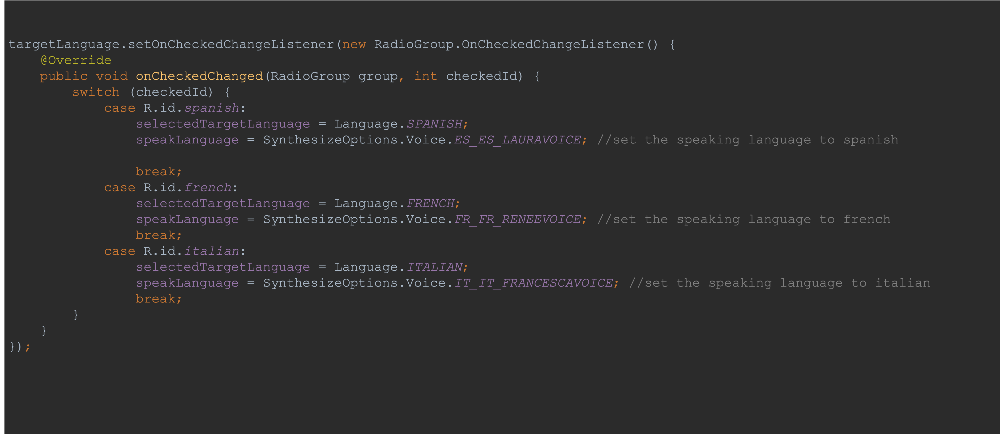
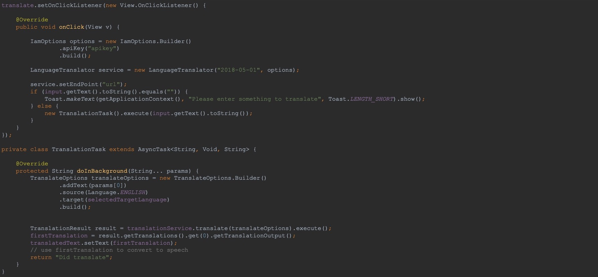
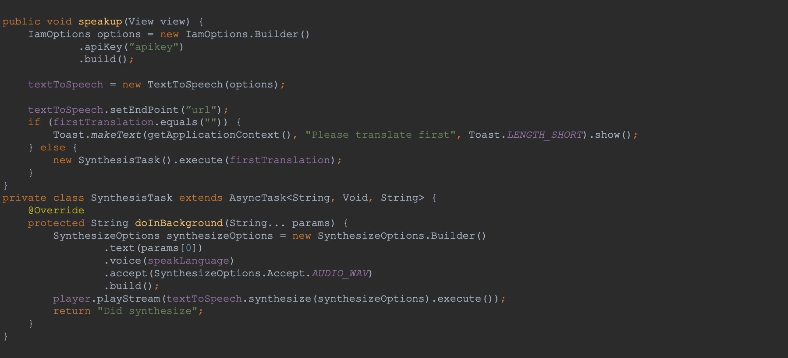
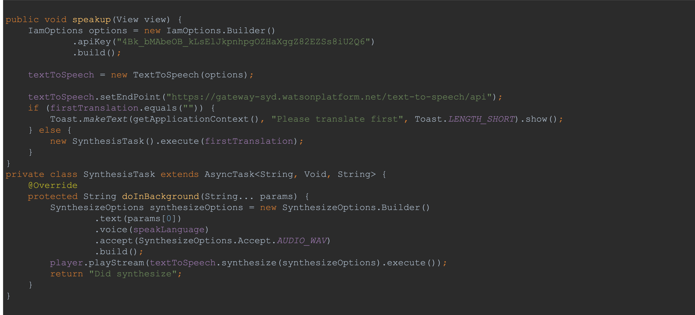

# Transl8
Android App using IBM Watson Translator service and Text-to-Speech service.

## Android Application

The purpose of the application is to allow people to easily learn Spanish, Italian or French. 
Also, being a translator in foreign countries to avoid communication barrier between two people who speak different languages.

## Prerequisites

1. Sign up for an [IBM Cloud account](https://cloud.ibm.com/registration/).
2. Download the [IBM Cloud CLI](https://console.bluemix.net/docs/cli/index.html#overview).
3. Create an instance of the Watson Language Translator service and get your credentials:
    - Go to the [Watson Language Translator](https://cloud.ibm.com/catalog/services/language-translator) page in the IBM Cloud Catalog.
    - Log in to your IBM Cloud account.
    - Click **Create**.
    - Click **Show** to view the service credentials.
    - Copy the `apikey` value, or copy the `username` and `password` values if your service instance doesn't provide an `apikey`.
    - Copy the `url` value.
 4. Create an instance of the Watson Text-to-Speech service and get your credentials:
    - Go to the [Watson Text-to-Speech](https://cloud.ibm.com/catalog/services/text-to-speech) page in the IBM Cloud Catalog.
    - Log in to your IBM Cloud account.
    - Click **Create**.
    - Click **Show** to view the service credentials.
    - Copy the `apikey` value, or copy the `username` and `password` values if your service instance doesn't provide an `apikey`.
    - Copy the `url` value.


#### Adding the Credentials

Once you've followed the instructions above to get credentials, they should be added to the `example/res/values/credentials.xml` file shown below.

```xml
<resources>
  <!-- Paste Language Translator information here -->
  <string name="language_translator_iam_apikey"></string>
  <string name="language_translator_url"></string>

  <!-- Paste Text to Speech information here -->
  <string name="text_speech_iam_apikey"></string>
  <string name="text_speech_url"></string>
</resources>
```

## ARCHITECTURE



## APPLICATION FLOW:


### Switch Code



### TRANSLATE

The application uses IBM Watson translator service to translate the text written in English.
A user can enter the text and then with the press of a button, the text is translated to the language selected.



#### Translate Code




### SPEAK

The application uses IBM Watson Text-to-Speech service to convert the written text to speech so the user can learn how to pronounce translated words/sentences.
With the press of a button, the translated text is converted to speech in the language selected.

#### Text-to-Speech Code



